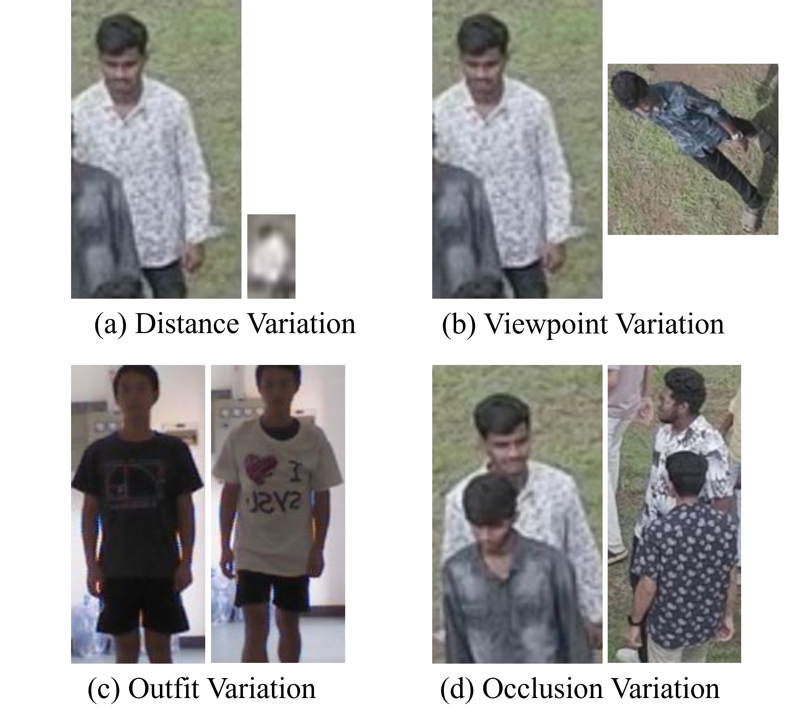
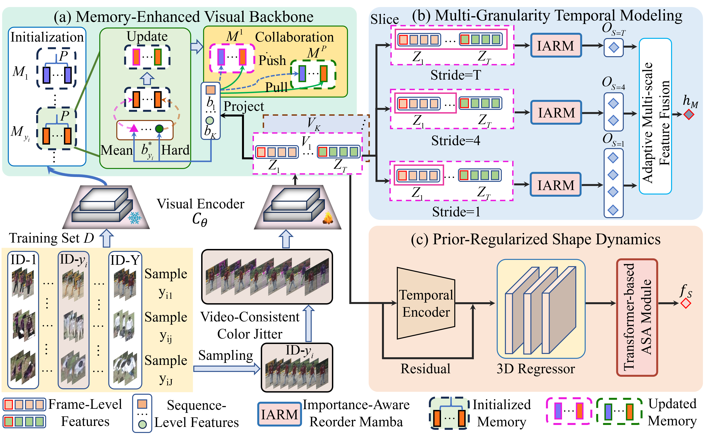
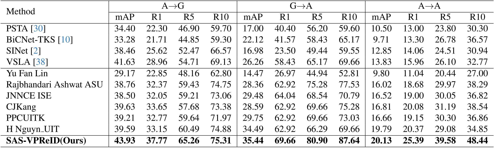
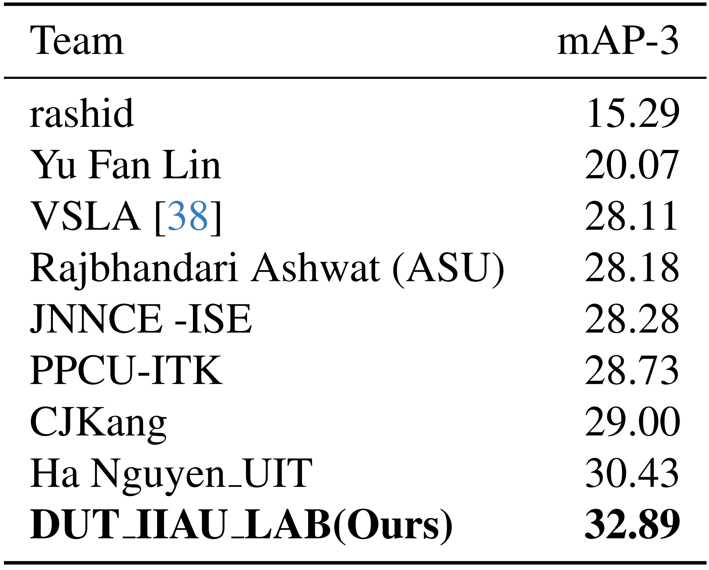
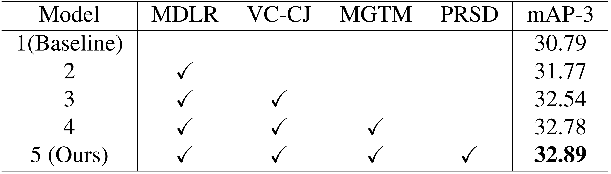
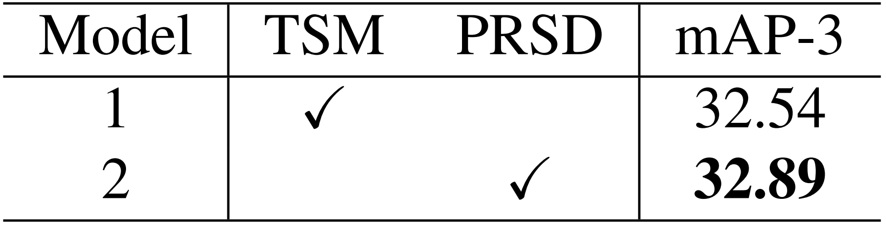
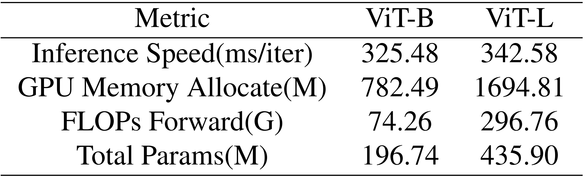

<p align="center">

  <h1 align="center">SAS-VPReID: A Scale-Adaptive Framework with Shape Priors for Video-based Person Re-Identification at Extreme Far Distances</h1>

  <p align="center">
    <a href="https://github.com/YangQiWei3" rel="external nofollow noopener" target="_blank"><strong>Qiwei Yang</strong></a>
    ·
    <a href="https://scholar.google.com/citations?user=MfbIbuEAAAAJ&hl=zh-CN" rel="external nofollow noopener" target="_blank"><strong>Pingping Zhang*</strong></a>
    ·
    <a href="https://924973292.github.io/" rel="external nofollow noopener" target="_blank"><strong>Yuhao Wang</strong></a>
    ·
    <a href="" rel="external nofollow noopener" target="_blank"><strong>Zijing Gong</strong></a>
  </p>
<p align="center">
    <a href="https://arxiv.org/abs/2601.05535" rel="external nofollow noopener" target="_blank">WACV2026 VReID-XFD Workshop Paper</a>
  <p align="center">
    
  <p align="center">
<p align="center" style="font-size: 18px; color: gray;">
    Figure 1: Examples illustrating four major variations in the VReID-XFD challenge.
</p>
<p align="center">
    
</p>
<p align="center" style="font-size: 18px; color: gray;">
    Figure 2: Overall Framework of SAS-VPReID.
</p>

## **Abstract** 📝
Video-based Person Re-IDentification (VPReID) aims to retrieve the same person from videos captured by non-overlapping cameras. At extreme far distances, VPReID is highly challenging due to severe resolution degradation, drastic viewpoint variation and inevitable appearance noise. To address these issues, we propose a Scale-Adaptive framework with Shape Priors for VPReID, named SAS-VPReID. The framework is built upon three complementary modules. First, we deploy a **Memory-Enhanced Visual Backbone (MEVB)** to extract discriminative feature representations, which leverages the CLIP vision encoder and multi-proxy memory. Second, we propose a **Multi-Granularity Temporal Modeling (MGTM)** to construct sequences at multiple temporal granularities and adaptively emphasize motion cues across scales. Third, we incorporate **Prior-Regularized Shape Dynamics (PRSD)** to capture body structure dynamics. With these modules, our framework can obtain more discriminative feature representations. Experiments on the VReID-XFD benchmark demonstrate the effectiveness of each module and our final framework ranks the first on the VReID-XFD challenge leaderboard.

---


## News 📢
- We released the **SAS-VPReID** codebase!
- Great news! Our method ranks **the first** on the VReID-XFD challenge leaderboard! 🏆
- Great news! Our paper has been accepted to **WACV2026 VReID-XFD Workshop**! 🏆

---

## Table of Contents 📑
- [Introduction](#introduction)
- [Contributions](#contributions)
- [Experimental Results](#experimental-results)
- [Visualizations](#visualizations)
- [Reproduction](#reproduction)
- [Citation](#citation)

---
## **Introduction** 🌟

Video-based Person Re-identification (VPReID) aims to retrieve the same person from tracklets captured by non-overlapping cameras. In the **VReID-XFD** setting, this task becomes substantially harder due to **extreme far-distance resolution degradation**, **drastic aerial–ground viewpoint/domain gaps**, and **cross-session clothing changes**, all of which often co-occur in real-world scenarios. 

To tackle these challenges, we propose **SAS-VPReID**, a **Scale-Adaptive framework with Shape Priors** for extreme far-distance VPReID. Our framework jointly (1) strengthens discriminative appearance representations, (2) captures multi-granularity temporal dynamics, and (3) injects clothing-invariant human-centric structural cues. 

Specifically, **SAS-VPReID** integrates three complementary modules: 

1. **Memory-Enhanced Visual Backbone (MEVB)**: Adapts a CLIP-based visual backbone with **video-consistent augmentation** and **memory-enhanced supervision** to stabilize optimization under extreme degradation and large domain shifts. 
2. **Multi-Granularity Temporal Modeling (MGTM)**: Builds sequences at **multiple temporal granularities** and performs **scale fusion** to efficiently capture spatiotemporal context when discriminative cues appear intermittently. 
3. **Prior-Regularized Shape Dynamics (PRSD)**: Leverages **SMPL-based 3D shape cues** and an explicit shape prior to model body-structure dynamics, providing a **clothing-robust** complement to appearance features. 

Extensive experiments on the **DetReIDXV1** benchmark validate the effectiveness of each module, and our final model ranks **1st** on the VReID-XFD challenge leaderboard (mAP-3 **32.89**). 

<!-- ---

## **Contributions** ✨
- Present **SAS-VPReID**, a new framework for **video-based ReID** with three key components. It handles the **extreme far-distance** and **cloth-changing challenges** in the VReID-XFD setting.
    - **MEVB**: to better adapt CLIP-based representations to the extreme far-distance degradation and clothing change ReID, via **video-consistent data augmentation** and **memory-enhanced supervision**.
    - **MGTM**: with sequence modeling and scale fusion to capture **multi-granularity spatiotemporal** cues from tracklets efficiently.
    - **PRSD**: with **3D shape cues** to complement appearance features and improve clothing robustness.
- Extensive experiments on the DetReIDXV1 benchmark demonstrate the effectiveness of our proposed framework. Meanwhile, our method ranks the first on the VReID-XFD challenge leaderboard. -->


---

## **Quick View** 📊
<!-- ### Dataset Examples
#### Overview of Annotations 
<p align="center">
    
</p>

#### Multi-modal Person ReID Annotations Example
<p align="center">
    
</p>

#### Multi-modal Vehicle ReID Annotations Example
<p align="center">
    
</p> -->

### Experimental Results
#### Performance comparison on DetReIDXV1 benchmark
<p align="center">
  
</p>

#### Leaderboard results on DetReIDXV1 benchmark for the VReID-XFD challenge
<p align="center">
    
</p>

#### Module ablation on DetReIDXV1
<p align="center">
    
</p>

#### Performance comparison of TSM and PRSD on DetReIDXV1 benchmark
<p align="center">
    
</p>

### Parameter Analysis
<p align="center">
    
</p>

<!-- ---

## **Visualizations** 🖼️

### Offsets Visualization
<p align="center">
    
</p>

### Cosine Similarity Visualization
<p align="center">
    
</p>

### Semantic Guidance Visualization
<p align="center">
    
</p>

### Rank-list Visualization
#### Multi-modal Person ReID 
<p align="center">
    
</p>

#### Multi-modal Vehicle ReID 
<p align="center">
    
</p> -->

---

## **Quick Start** 🚀

### Datasets
- **DetReIDXV1**: [Kaggle Site](https://www.kaggle.com/competitions/detreidxv1/data)  
<!-- - **RGBNT100**: [Baidu Pan](https://pan.baidu.com/s/1xqqh7N4Lctm3RcUdskG0Ug) (Code: `rjin`)  
- **MSVR310**: [Google Drive](https://drive.google.com/file/d/1IxI-fGiluPO_Ies6YjDHeTEuVYhFdYwD/view?usp=drive_link)
- **Annotations**: QwenVL_Anno -->

<!-- ### Codebase Structure
```
IDEA_Codes
├── PTH                           # Pre-trained models
│   └── ViT-B-16.pt               # CLIP model
├── DATA                          # Dataset root directory
│   ├── RGBNT201                  # RGBNT201 dataset
│   │   ├── train_171             # Training images (171 classes)
│   │   ├── test                  # Testing images
│   │   ├── text                  # Annotations
│   │   │   ├── train_RGB.json    # Training annotations
│   │   │   ├── test_RGB.json     # Testing annotations
│   │   │   └── ...               # Other annotations
│   ├── RGBNT100                  # RGBNT100 dataset
│   └── MSVR310                   # MSVR310 dataset
├── assets                        # Github assets
├── config                        # Configuration files
├── QwenVL_Anno                   # **YOU SHOULD PUT YOUR ANNOTATIONS TO THE DATA FOLDER**
└── ...                           # Other project files
``` -->

<!-- ### Pretrained Models
- **CLIP**: [Baidu Pan](https://pan.baidu.com/s/1YPhaL0YgpI-TQ_pSzXHRKw) (Code: `52fu`) -->

### Configuration
- CLIP ViT Large P14: `configs/vit_clipreid.yml` 
- CLIP ViT Base P16: `configs/vit_clipreid_base.yml`  

### Training
```bash
conda create -n SAS python=3.10.13
conda activate SAS
cd ../SAS_PUBLIC
pip install --upgrade pip
pip install -r requirements.txt
#Training was performed using ViT-Large-14.
CUDA_VISIBLE_DEVICES=0 python train_climb.py --config_file configs/vit_clipreid.yml
#Training was performed using ViT-Base-16.
CUDA_VISIBLE_DEVICES=0 python train_climb.py --config_file configs/vit_clipreid_base.yml
```
### Testing 
```bash
conda activate SAS
cd ../SAS_PUBLIC
#Testing was performed using ViT-Large-14.
CUDA_VISIBLE_DEVICES=0 python evaluate_all_cases.py --config_file configs/vit_clipreid.yml --model_path output_original/**.pth
#Testing was performed using ViT-Base-16.
CUDA_VISIBLE_DEVICES=0 python evaluate_all_cases.py --config_file configs/vit_clipreid_base.yml --model_path output_original/**.pth
```

<!-- ### Training Example
- **RGBNT201**: [LOGFILE](./assets/train_log.txt) / [WEIGHT](https://pan.baidu.com/s/1t2j9yoVvGp6t0CepxUGpRA)
- **CODE**: g6om -->

<!-- ## **Poster** 📜
<p align="center">
    
</p> -->

---

## Star History 🌟

[](https://star-history.com/#YangQiWei3/SAS-VPReID&Date)

---

## **Citation** 📚

If you find **SAS-VPReID** helpful in your research, please consider citing:
```bibtex
@article{yang2026sas,
  title={SAS-VPReID: A Scale-Adaptive Framework with Shape Priors for Video-based Person Re-Identification at Extreme Far Distances},
  author={Yang, Qiwei and Zhang, Pingping and Wang, Yuhao and Gong, Zijing},
  journal={arXiv preprint arXiv:2601.05535},
  year={2026}
}
```

---